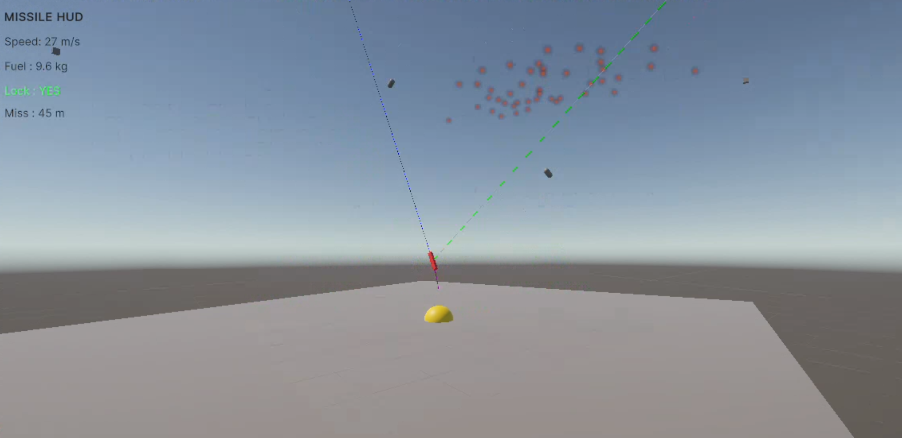

# 🚀 Hlynr Missile Intercept Simulator Scripts

  

A comprehensive Unity-based missile intercept simulation system featuring realistic physics, guidance algorithms, and telemetry analysis.

## Core System (`Core/`)

### SimBootstrap.cs
Main simulation controller providing:
- Fixed timestep physics (0.01s default)
- Pause/resume functionality (Space key)
- Single-step simulation when paused (Right arrow)
- Scene reset capability (R key)

### FlyCamera.cs
Free-flying camera system for scene navigation and observation.

## Missile System (`Missile/`)

### Missile6DOFController.cs
Six degrees-of-freedom missile controller handling body-axis torques for pitch, yaw, and roll control with configurable maximum torque limits.

### GuidanceProNav.cs
Proportional navigation guidance system implementing:
- Line-of-sight (LOS) pursuit algorithms
- Target acquisition and tracking
- Angular velocity calculations for intercept trajectories
- Integration with seeker sensor for target lock

### PIDAttitudeController.cs
PID-based attitude control system for precise missile orientation and rate command execution.

### ThrustModel.cs
Realistic rocket motor simulation featuring:
- Thrust curve evaluation over burn time
- Dynamic mass reduction as fuel is consumed
- Configurable thrust axis alignment

### ThrustCurve.cs & FuelSystem.cs
Supporting systems for thrust profile management and fuel consumption modeling.

### SeekerSensor.cs
Target detection and tracking sensor providing lock-on capabilities for guidance systems.

### ProximityFuse.cs
Warhead proximity detection system for intercept determination.

### MissileLauncher.cs
Launch sequence management and initial velocity imparting system.

## Entity Management (`Entities/`)

### ThreatSpawner.cs
Automated threat generation system:
- Configurable spawn intervals and positions
- Linear spawn line between defined points
- Global threat tracking for interceptor targeting

### InterceptorSpawner.cs
User-controlled interceptor launch system:
- Manual launch via 'I' key
- Automatic target assignment to current threat
- Integration with guidance and seeker systems

### ThreatGuidance.cs
AI guidance system for threat entities with configurable flight patterns.

## User Interface (`UI/`)

### MissileHUDController.cs
Real-time missile telemetry display showing:
- Current speed and fuel levels
- Target lock status with visual indicators
- Miss distance calculations
- Integration with Unity's UI Toolkit

### HitAlert.cs
Impact notification and feedback system.

## Analytics (`Analytics/`)

### TelemetryLogger.cs
Comprehensive data logging system capturing:
- Position and velocity vectors
- Fuel consumption rates
- Thrust output values
- CSV export with configurable flush intervals
- Automatic file naming with timestamps

### ForceVisualizer.cs
Visual debugging tool for force vector analysis and aerodynamic visualization.

## Controls

- **Space**: Pause/unpause simulation
- **Right Arrow**: Step one physics tick when paused
- **R**: Reset scene
- **I**: Launch interceptor missile

## Data Output

The system automatically generates telemetry logs in CSV format containing time-series data for missile position, velocity, fuel consumption, and thrust output. Files are saved to Unity's persistent data path with automatic timestamp naming.

## Architecture

The system follows a modular component-based architecture where missiles are composed of multiple specialized components (guidance, control, propulsion, sensors) that work together to create realistic intercept scenarios. The simulation runs on a fixed timestep for deterministic physics calculations and supports real-time analysis through comprehensive telemetry logging.